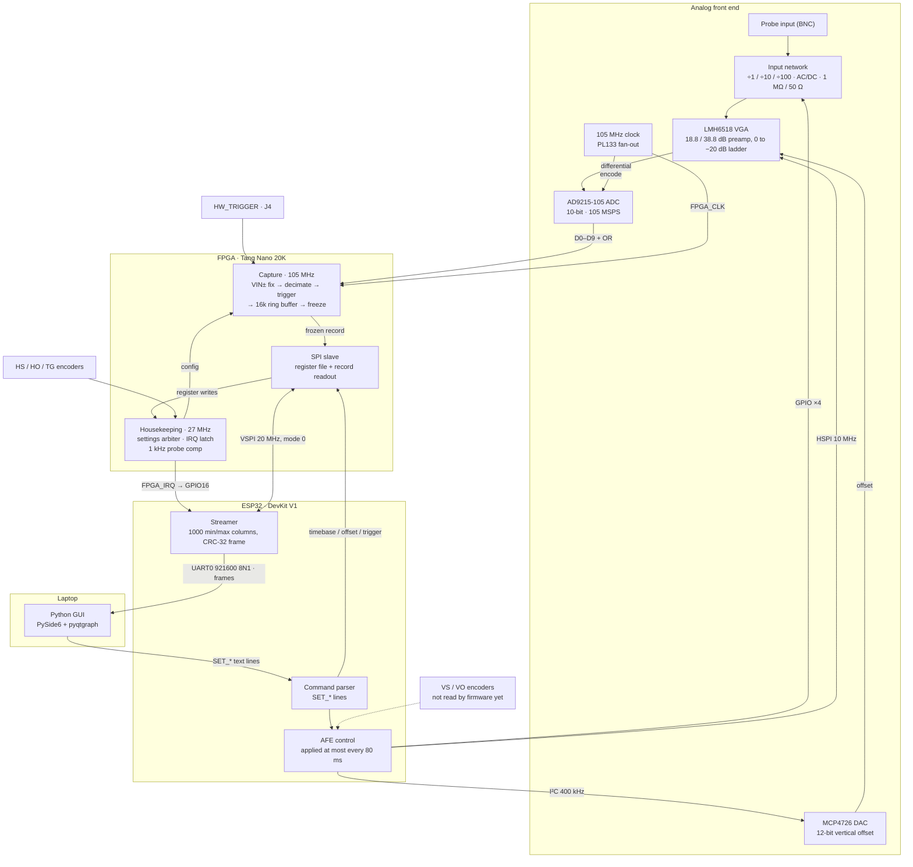

# Oscilloscope

A single-channel 105 MSPS oscilloscope. An AD9215 ADC feeds a Tang Nano 20K FPGA that triggers and freezes captures; an ESP32 sets the analog front end, reads each frozen record over SPI, reduces it to a 1000-column min/max envelope and streams it over USB-UART to a Python GUI, which sends control commands back on the same link.

## Hardware

- Sipeed Tang Nano 20K (GW2AR-18C) — [datasheet](https://dl.sipeed.com/shareURL/TANG/Nano_20K/1_Datasheet)
- ESP32 DevKit V1 (Elegoo, ESP-WROOM-32) (laptop link)
- AD9215-105 ADC (10-bit, 105 MSPS), PL133 clock fan-out
- LMH6518 variable-gain amplifier, MCP4726 offset DAC, relay FETs for divider / coupling / termination

## System architecture



| Block | Role |
|-------|------|
| **Analog front end** | Input divider, AC/DC coupling and 1 MΩ/50 Ω termination relays → LMH6518 gain → AD9215 at 105 MSPS; MCP4726 sets vertical offset |
| **FPGA** | Captures the ADC bus, corrects the swapped VIN±, decimates (optionally peak detect), triggers on level / external / force, freezes a record in a 16 384-sample ring buffer, raises `FPGA_IRQ`; SPI slave register file; reads the horizontal-scale, horizontal-offset and trigger-level knobs directly; generates the 1 kHz probe-compensation square wave |
| **ESP32** | Drives the front end (relays over GPIO, LMH6518 over HSPI, MCP4726 over I2C); VSPI master to the FPGA; on each `FPGA_IRQ` reads the record, reduces it to 1000 min/max columns and streams it over UART0; applies `SET_*` commands from the GUI |
| **GUI** | Draws the trace, trigger markers and readout from the streamed frames; Run/Pause and zoom; sends control commands back to the ESP32 |

### Links

| Link | Interface | Rate | Contract |
|------|-----------|------|----------|
| ADC → FPGA | 10-bit parallel + over-range, 2.5 V CMOS | 105 MSPS | `fpga/constr/pins.cst` |
| ESP32 ↔ FPGA | VSPI (SPI3), mode 0, plus `FPGA_IRQ` | 20 MHz (FPGA allows ≤ 40 MHz) | [`docs/PROTOCOL.md`](docs/PROTOCOL.md) |
| ESP32 → LMH6518 | HSPI (SPI2), 3-wire, write-only | 10 MHz | `components/lmh6518` |
| ESP32 → MCP4726 | I2C, address 0x60 | 400 kHz | `components/mcp4726` |
| ESP32 → laptop | UART0 via USB-serial bridge, 8N1, binary frames | 921600 baud, ≈20 frames/s | [`docs/STREAM.md`](docs/STREAM.md) |
| Laptop → ESP32 | Same UART0, text command lines, no reply | 921600 baud | [`docs/CONTROL.md`](docs/CONTROL.md) |

The FPGA runs three clock domains: 105 MHz capture (`FPGA_CLK` through an rPLL), 27 MHz housekeeping (onboard crystal: knobs, probe comp, IRQ, settings) and the SPI clock.

## Pinout

### ESP32 (DevKit V1, Elegoo ESP-WROOM-32)

| Net | GPIO | Silk Screen | Why |
|-----|------|------|-----|
| `SDA` | 21 | D21 | Hardware I2C: MCP4726 + J5 (`VSPIHD` unused) |
| `SCL` | 22 | D22 | Hardware I2C: MCP4726 + J5 (`VSPIWP` unused) |
| `FPGA_SCLK` | 18 | D18 | `VSPICLK` → FPGA register access + record dump |
| `FPGA_MOSI` | 23 | D23 | `VSPID` → FPGA commands |
| `FPGA_MISO` | 19 | D19 | `VSPIQ` ← FPGA sample dump; not on the Altium schematic yet |
| `FPGA_CS` | 5 | D5 | `VSPICS0`, idle-high |
| `FPGA_IRQ` | 16 | RX2 | Capture-ready from FPGA J6-6; active-high, needs internal pull-down |
| `VGA_SCLK` | 14 | D14 | SPI Clk for control of the `LMH6518SQ` |
| `VGA_MOSI` | 13 | D13 | MOSI control for the `LMH6518SQ` |
| `VGA_CS` | 15 | D15 | Chip select for the `LMH6518SQ` |
| `100X_10X` | 32 | D32 | Divider relay FET: 100× / 10× select (polarity unconfirmed, see `afe.c`) |
| `10X_1X` | 33 | D33 | Divider relay FET: 10× / 1× select (polarity unconfirmed, see `afe.c`) |
| `DC_COUP` | 25 | D25 | Coupling relay FET: high = DC, low = AC |
| `50_OHM_TERM` | 26 | D26 | Termination relay FET: high = 50 Ω, low = 1 MΩ |
| `DIAL_VS_A` | 36 | VP | Vertical-scale encoder A (input-only pin; not read by firmware yet) |
| `DIAL_VS_B` | 39 | VN | Vertical-scale encoder B (input-only pin; not read by firmware yet) |
| `DIAL_VS_BTN` | 34 | D34 | Vertical-scale button (input-only pin; not read by firmware yet) |
| `DIAL_VO_A` | 35 | D35 | Vertical-offset encoder A (input-only pin; not read by firmware yet) |
| `DIAL_VO_B` | 17 | TX2 | Vertical-offset encoder B (was `ESP_FLEX_1`; not read yet) |
| `DIAL_VO_BTN` | 4 | D4 | Vertical-offset button (was `ESP_FLEX_2`; not read yet) |
| `ESP_FLEX_3` | 27 | D27 | Spare line to the J5 trigger module |

### FPGA (Tang Nano 20K)

| Header | Net | FPGA pin | Nano silk | Why |
|--------|-----|----------|-----------|-----|
| J6-1 | GND | — | GND | Common ground |
| J6-2 | 3V3 | — | 3V3 | I/O rail |
| J6-3 | — | 18 | `IOL49B` / LED3 | Spare |
| J6-4 | — | 19 | `IOL51A` / LED4 | Spare |
| J6-5 | — | 20 | `IOL51B` / LED5 | Spare |
| J6-6 | `FPGA_IRQ` | 17 | `IOL49A` / LED2 | Capture-ready → ESP32; active-high, idle low |
| J6-7 | `PROBE_COMP` | 31 | `IOB29A` / LCD_B3 | Cal square; also J8-2 |
| J6-8 | `DIAL_TG_BTN` | 30 | `IOB14B` / LCD_B4 | Trigger encoder button |
| J6-9 | `DIAL_TG_B` | 29 | `IOB14A` / LCD_B5 | Trigger encoder B |
| J6-10 | `DIAL_TG_A` | 26 | `IOB6B` / LCD_VS | Trigger encoder A |
| J6-11 | `FPGA_SPI_MISO` | 25 | `IOB6A` / LCD_HS | VSPI MISO: frozen sample dump |
| J6-12 | `FPGA_SPI_MOSI` | 28 | `IOB8B` / LCD_B6 | VSPI MOSI: ESP32 commands |
| J6-13 | `FPGA_SPI_CS` | 27 | `IOB8A` / LCD_B7 | VSPI CS, idle-high |
| J6-14 | `DIAL_HS_A` | 16 | `IOL47B` / LED1 | Horizontal scale encoder A |
| J6-15 | `DIAL_HS_B` | 15 | `IOL47A` / LED0 | Horizontal scale encoder B |
| J6-16 | `FPGA_SPI_SCLK` | 77 | `IOT30A` / LCD_CLK | VSPI clock (GCLK; `GCLKC_0` is `ADC_OR`) |
| J6-17 | `DIAL_HS_BTN` | 85 | `IOT4B` / SDIO_D1 | Horizontal scale button |
| J6-18 | `DIAL_HO_A` | 75 | `IOT34A` / HSPI_DIR | Horizontal offset encoder A |
| J6-19 | `DIAL_HO_B` | 74 | `IOT34B` / HSPI_DIN3 | Horizontal offset encoder B |
| J6-20 | `DIAL_HO_BTN` | 73 | `IOT40A` / HSPI_DIN2 | Horizontal offset button |
| J7-1 | `FPGA_FLEX_3` | 52 | `IOR39A` / BL616_UART_RX | J4 trigger mezzanine |
| J7-2 | `FPGA_FLEX_2` | 53 | `IOR38B` / EDID_CLK | J4 trigger mezzanine |
| J7-3 | `FPGA_FLEX_1` | 71 | `IOT44A` / HSPI_DIN0 | J4 trigger mezzanine |
| J7-4 | `HW_TRIGGER` | 72 | `IOT40B` / HSPI_DIN1 | Digital trigger in from J4 |
| J7-5 | 3V3 | — | 3V3 | I/O rail |
| J7-6 | GND | — | GND | Common ground |
| J7-7 | `ADC_OR` | 79 | `IOT27B` / `GCLKC_0` / 2812_DIN | Overflow |
| J7-8 | `ADC_D9` | 86 | `IOT4A` / HSPI_CSN | MSB of the parallel bus |
| J7-9 | `ADC_D8` | 49 | `IOR49A` / LCD_BL | Consecutive down J7 |
| J7-10 | `ADC_D7` | 55 | `IOR36B` / I2S_LRCK | Consecutive |
| J7-11 | `ADC_D6` | 48 | `IOR49B` / LCD_DE | Consecutive |
| J7-12 | `ADC_D5` | 51 | `IOR45A` / PA_EN | Consecutive |
| J7-13 | `ADC_D4` | 54 | `IOR38A` / I2S_DIN | Consecutive |
| J7-14 | `ADC_D3` | 56 | `IOR36A` / I2S_BCLK | Consecutive |
| J7-15 | `ADC_D2` | 41 | `IOB43A` / LCD_R4 | Consecutive |
| J7-16 | `ADC_D1` | 42 | `IOB42B` / LCD_R3 | Consecutive |
| J7-17 | `ADC_D0` | 80 | `IOT27A` / SDIO_D2 | LSB |
| J7-18 | `FPGA_CLK` | 76 | `IOT30B` / `GCLKC_1` | 105 MHz from PL133 via 30 Ω (`R51`) |
| J7-19 | GND | — | GND | Common ground |
| J7-20 | 5V | — | 5V | Through Schottky `D12`; do not back-power blindly |


## Repository layout

| Path | Role |
|------|------|
| `fpga/rtl/` | Tang Nano 20K RTL: capture datapath, trigger, ring buffer, SPI slave, encoders |
| `fpga/sim/` | Icarus Verilog test benches (`make -C fpga sim`) |
| `fpga/constr/` | `.cst` pin map, `.sdc` timing |
| `fpga/build/` | Gowin `gw_sh` build script |
| `esp32/` | ESP-IDF firmware: AFE control + `fpga_link.c` SPI-master driver + streamer |
| `gui/` | Python host display + control (`oscilloscope-gui --port /dev/ttyUSB0`, PySide6 + pyqtgraph) |
| `gui/tools/` | Hardware-free demo: `fake_scope.py` streams a synthetic sine wave, `run_demo.sh` wires it to the GUI over a virtual serial pair |
| `docs/PROTOCOL.md` | ESP32 ↔ FPGA SPI register contract (shared by `scope_regs.svh` / `scope_proto.h`) |
| `docs/STREAM.md` | ESP32 → host sample-stream format (shared by `stream_frame.h` / `frame.py`) |
| `docs/CONTROL.md` | Host → ESP32 control-command format (shared by `cmd_parse.h` / `control.py`) |

## Build

**FPGA** (needs [Gowin EDA](https://www.gowinsemi.com/) `gw_sh` and [openFPGALoader](https://github.com/trabucayre/openFPGALoader)):

```bash
make -C fpga/ build
make -C fpga/ prog
```

**FPGA simulation** (needs [Icarus Verilog](https://steveicarus.github.io/iverilog/)):

```bash
make -C fpga/ sim            # run every bench
make -C fpga/sim tb_top      # one bench; WAVES=1 also writes build/<name>.vcd
```

**ESP32** (needs [ESP-IDF](https://docs.espressif.com/projects/esp-idf/)):

```bash
cd esp32
idf.py set-target esp32
idf.py build
idf.py flash
```

Do not leave `idf.py monitor` attached while the GUI is running — the sample
stream and the monitor share UART0, and only one process can hold the port.

The framing, column-reduction, and control-command-parsing logic all build
without ESP-IDF, so they can be tested with just a C compiler:

```bash
make -C esp32/test
```

**Host GUI** (needs [Python](https://www.python.org/) >= 3.10):

```bash
cd gui
python -m venv .venv && source .venv/bin/activate
pip install -e ".[dev]"
oscilloscope-gui --list                  # show serial ports
oscilloscope-gui --port /dev/ttyUSB0
pytest                                   # includes the C-interop format check
```

GUI controls: **Pause/Run** (`Space`) freezes the trace; **Zoom +** / **Zoom −** / **Fit** (`Ctrl+=` / `Ctrl+-` / `Ctrl+0`), or the mouse wheel over the plot.

**GUI without hardware** (needs `socat`): streams a synthetic sine wave through a virtual serial pair and opens the GUI on it. Closing the GUI or pressing `Ctrl+C` shuts everything down.

```bash
cd gui
./tools/run_demo.sh                      # extra flags pass to fake_scope.py, e.g. --freq 2 --amplitude 300
```

## Branch protection (`main`)

Direct pushes and force pushes to `main` are not allowed. Work on a branch and open a pull request:

```bash
git checkout -b my-change
git push -u origin HEAD
# open a PR into main, then merge on GitHub
```

Enforcement is a GitHub **repository ruleset** (not Actions alone). The policy lives in [`.github/rulesets/main.json`](.github/rulesets/main.json).

### One-time ruleset setup

1. Create a fine-grained PAT with **Administration: Read and write** for this repository.
2. Add it as a repository secret named `RULESET_TOKEN`.
3. Run the **Apply main ruleset** workflow (`workflow_dispatch`), or apply locally:

```bash
export RULESET_TOKEN=...   # same PAT
export GITHUB_REPOSITORY=AveryLor/oscilloscope-dev
./.github/scripts/apply-main-ruleset.sh
```

Repository admins can bypass the ruleset for break-glass only. [`.github/workflows/guard-main.yml`](.github/workflows/guard-main.yml) also fails the Actions run if a forced push to `main` is ever observed.
