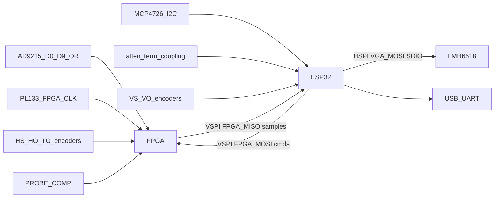

# Oscilloscope

FPGA + ESP32 firmware for an oscilloscope: the Tang Nano 20K buffers ADC samples; an ESP32 streams them to a laptop for display.

## Hardware

- Sipeed Tang Nano 20K (GW2AR-18C) — [datasheet](https://dl.sipeed.com/shareURL/TANG/Nano_20K/1_Datasheet)
- ESP32 NodeMCU-32S (laptop link)

## System architecture

Mermaid flowchart of ADC capture flow from the schematics. 



| Block | Role |
|-------|------|
| **FPGA** | 100 Msps capture (`ADC_D*` + `FPGA_CLK`), timebase/trigger knobs, probe-comp, optional J4 trigger mezzanine, SPI slave dump |
| **ESP32** | Analog frontend (VGA, LNA DAC, relays), vertical knobs, SPI master, stream frozen captures over USB-UART |

Vertical knobs stay on the ESP32 (frontend gain/offset). Horizontal and trigger knobs stay on the FPGA (capture timing). Dataflow is **freeze-mode / single-shot**: the FPGA fills a ring buffer, a trigger decides when to stop, then the ESP32 dumps the window. It is not a continuous 100 Msps pipe.

## Pinout

### FPGA (Tang Nano 20K)

| Net | J6/J7 | FPGA pin | Nano silk | Why |
|-----|-------|----------|-----------|-----|
| `ADC_D0` | J6-13 | 27 | `IOB8A` / LCD_B7 | Bank 5 cluster, LSB of the parallel bus |
| `ADC_D1` | J6-12 | 28 | `IOB8B` / LCD_B6 | Consecutive with D0 |
| `ADC_D2` | J6-11 | 25 | `IOB6A` / LCD_HS | Consecutive |
| `ADC_D3` | J6-10 | 26 | `IOB6B` / LCD_VS | Consecutive |
| `ADC_D4` | J6-9 | 29 | `IOB14A` / LCD_B5 | Consecutive |
| `ADC_D5` | J6-8 | 30 | `IOB14B` / LCD_B4 | Consecutive |
| `ADC_D6` | J6-7 | 31 | `IOB29A` / LCD_B3 | Consecutive |
| `ADC_D7` | J6-6 | 17 | `IOL49A` / LED2 | Adjacent `IOL*` after Bank 5 runs out |
| `ADC_D8` | J6-5 | 20 | `IOL51B` / LED5 | Adjacent `IOL*` |
| `ADC_D9` | J6-4 | 19 | `IOL51A` / LED4 | Adjacent `IOL*` |
| `ADC_OR` | J6-3 | 18 | `IOL49B` / LED3 | Overflow; least timing-critical, farthest from clock |
| `FPGA_CLK` | J7-18 | 76 | `IOT30B` / `GCLKC_1` | 100 MHz from PL133 via 30 Ω (`R51`); must hit a global clock, opposite header from data |
| `FPGA_SPI_SCLK` | J7-7 | 79 | `IOT27B` / `GCLKC_0` / 2812_DIN | ESP32 VSPI master clock; slave uses the other GCLK. Leave WS2812 unused |
| `FPGA_SPI_CS` | J7-8 | 86 | `IOT4A` / HSPI_CSN | VSPI CS. Nano `HSPI_*` silk is the FPGA module print, not the ESP32 HSPI controller |
| `FPGA_SPI_MOSI` | J7-4 | 72 | `IOT40B` / HSPI_DIN1 | VSPI MOSI: ESP32 commands / dummy bytes into the FPGA slave |
| `FPGA_SPI_MISO` | J7-3 | 71 | `IOT44A` / HSPI_DIN0 | VSPI MISO: frozen sample dump. Same Nano-silk caveat |
| `DIAL_HS_A` | J6-14 | 16 | `IOL47B` / LED1 | Slow RC-filtered encoder; leftover J6 after ADC |
| `DIAL_HS_B` | J6-15 | 15 | `IOL47A` / LED0 | Same; onboard LED0 constraint removed so this pin is free |
| `DIAL_HS_BTN` | J6-17 | 85 | `IOT4B` / SDIO_D1 | Same |
| `DIAL_HO_A` | J6-18 | 75 | `IOT34A` / HSPI_DIR | Horizontal offset encoder |
| `DIAL_HO_B` | J6-19 | 74 | `IOT34B` / HSPI_DIN3 | Same |
| `DIAL_HO_BTN` | J6-20 | 73 | `IOT40A` / HSPI_DIN2 | Same |
| `DIAL_TG_A` | J7-9 | 49 | `IOR49A` / LCD_BL | Trigger knobs on the capture/SPI header |
| `DIAL_TG_B` | J7-10 | 55 | `IOR36B` / I2S_LRCK | Same |
| `DIAL_TG_BTN` | J7-11 | 48 | `IOR49B` / LCD_DE | Same |
| `PROBE_COMP` | J7-17 | 80 | `IOT27A` / SDIO_D2 | FPGA cal square; schematic J8-2 |
| `HW_TRIGGER` | J7-2 | 53 | `IOR38B` / EDID_CLK | Digital trigger in from J4; kept off the 100 MHz clock pin |
| `FPGA_FLEX_1` | J7-12 | 51 | `IOR45A` / PA_EN | J4 future trigger module |
| `FPGA_FLEX_2` | J7-13 | 54 | `IOR38A` / I2S_DIN | Same |
| `FPGA_FLEX_3` | J7-14 | 56 | `IOR36A` / I2S_BCLK | Same |
| GND | J6-1, J7-6, J7-19 | — | GND | Common ground with the ADC board |
| 3V3 | J6-2, J7-5 | — | 3V3 | I/O rail |
| 5V | J7-20 | — | 5V | Header 5 V only; do not back-power blindly |

### ESP32 (NodeMCU-32S)

Two SPI buses. **VSPI** (`SPI3`) is the FPGA dump only (4-wire). **HSPI** (`SPI2`) is the LMH6518 only (write-oriented 3-wire). They do not share SCLK or MOSI: the VGA datasheet caps SCLK at 10 MHz and says to stop the clock when idle, so a 15–30 MHz dump must not toggle on the analog chip. The second bus costs J5 `ESP_FLEX_1` / `ESP_FLEX_2`, which move to the vertical-offset encoder so HSPI can use its default CLK/MOSI pins. Do not short MOSI and MISO on either bus. `FPGA_MISO` never touches the VGA. GPIO12 stays unused (strapping; VGA has no MISO).

Tang Nano header silk such as `HSPI_CSN` / `HSPI_DIN0` is the FPGA module print. It is not the ESP32 HSPI controller.

| Net | GPIO | Silk | Why |
|-----|------|------|-----|
| `SDA` | 21 | P41 | Hardware I2C |
| `SCL` | 22 | P39 | Hardware I2C |
| `FPGA_SCLK` | 18 | P35 | VSPI CLK → FPGA dump only |
| `FPGA_MOSI` | 23 | P36 | VSPI MOSI → FPGA commands / dummy bytes |
| `FPGA_MISO` | 19 | P38 | VSPI MISO ← FPGA sample dump |
| `FPGA_CS` | 5 | P34 | VSPI CS0, idle-high |
| `FPGA_IRQ` | 16 | P25 | Capture-ready; poll SPI if this pin is dropped |
| `VGA_SCLK` | 14 | P14 | HSPI CLK → LMH6518; ≤10 MHz, idle when not writing |
| `VGA_MOSI` | 13 | P20 | HSPI MOSI → LMH6518 `SDIO` (writes only) |
| `VGA_CS` | 27 | P16 | HSPI CS remapped here; not GPIO15 (strapping) |
| `100X_10X` | 32 | P32 | Low-side FET drive; not an input-only GPIO |
| `10X_1X` | 33 | P33 | Same |
| `DC_COUP` | 25 | P25 | Same |
| `50_OHM_TERM` | 26 | P26 | Same |
| `DIAL_VS_A` | 36 | SVP | Input-only; RC-filtered vertical-scale encoder |
| `DIAL_VS_B` | 39 | SVN | Same |
| `DIAL_VS_BTN` | 34 | P34 | Same |
| `DIAL_VO_A` | 35 | P35 | Vertical-offset encoder |
| `DIAL_VO_B` | 17 | P17 | Was `ESP_FLEX_1`; freed HSPI MOSI |
| `DIAL_VO_BTN` | 4 | P4 | Was `ESP_FLEX_2`; freed HSPI CLK |
| `ESP_FLEX_3` | 15 | P15 | J5 only; idle-high is boot-safe; do not attach a module that pulls it low at reset |

Reserved: `GPIO1`/`GPIO3` (USB-UART to the laptop), `GPIO6–11` (flash), `GPIO0`/`GPIO2`/`GPIO12` (strapping).

Relays and VGA stay on the ESP32 because they are analog-frontend control, not the 100 Msps bus.

### Trigger expansion (J3 / J4 / J5)

These 8-pin headers are a **future hardware-trigger mezzanine**, not the ADC data path.

| Header | Role |
|--------|------|
| J3 | Analog/power: `VGA_AUX_*`, ±5 V analog |
| J4 | FPGA: `HW_TRIGGER`, `FPGA_FLEX_1..3` |
| J5 | ESP32: `SDA`/`SCL`, `ESP_FLEX_3` only (`ESP_FLEX_1`/`ESP_FLEX_2` used for `DIAL_VO_*`) |

### Schematic vs this map

`FPGA_CS`, `FPGA_MISO`, and `FPGA_IRQ` are firmware nets to add on the next Altium pass. VGA needs its own `VGA_SCLK` / `VGA_MOSI` / `VGA_CS` on that pass — do not tie them to the FPGA VSPI nets. Dump SPI is freeze-mode (~15–30 Mbps), not live 100 Msps.

Other constraints:

- Expect **capture → freeze → SPI dump → display**, not continuous roll at full sample rate (roll/decimation can run in the FPGA at a reduced rate).
- Deep memory and high UI refresh want a USB FIFO later; ESP32 is fine for bring-up, control plane, and modest capture depths.


## Repository layout

| Path | Role |
|------|------|
| `fpga/` | Tang Nano 20K RTL, constraints, Gowin build |
| `esp32/` | ESP-IDF firmware (streamer) |

## Build

**FPGA** (needs [Gowin EDA](https://www.gowinsemi.com/) `gw_sh` and [openFPGALoader](https://github.com/trabucayre/openFPGALoader)):

```bash
make -C fpga/ build
make -C fpga/ prog
```

**ESP32** (needs [ESP-IDF](https://docs.espressif.com/projects/esp-idf/)):

```bash
cd esp32
idf.py set-target esp32
idf.py build
idf.py flash monitor
```

## Branch protection (`main`)

Direct pushes and force pushes to `main` are not allowed. Work on a branch and open a pull request:

```bash
git checkout -b my-change
git push -u origin HEAD
# open a PR into main, then merge on GitHub
```

Enforcement is a GitHub **repository ruleset** (not Actions alone). The policy lives in [`.github/rulesets/main.json`](.github/rulesets/main.json).

### One-time ruleset setup

1. Create a fine-grained PAT with **Administration: Read and write** for this repository.
2. Add it as a repository secret named `RULESET_TOKEN`.
3. Run the **Apply main ruleset** workflow (`workflow_dispatch`), or apply locally:

```bash
export RULESET_TOKEN=...   # same PAT
export GITHUB_REPOSITORY=AveryLor/oscilloscope-dev
./.github/scripts/apply-main-ruleset.sh
```

Repository admins can bypass the ruleset for break-glass only. [`.github/workflows/guard-main.yml`](.github/workflows/guard-main.yml) also fails the Actions run if a forced push to `main` is ever observed.
