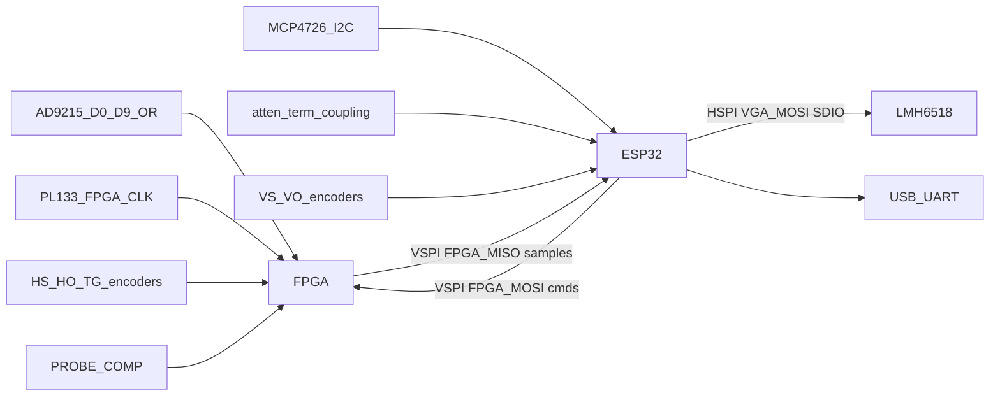

# Oscilloscope

FPGA + ESP32 firmware for an oscilloscope: the Tang Nano 20K buffers ADC samples; an ESP32 streams them to a laptop for display.

## Hardware

- Sipeed Tang Nano 20K (GW2AR-18C) — [datasheet](https://dl.sipeed.com/shareURL/TANG/Nano_20K/1_Datasheet)
- ESP32 NodeMCU-32S (laptop link)

## System architecture

Mermaid flowchart of ADC capture flow from the schematics. 



| Block | Role |
|-------|------|
| **ESP32** | VGA, LNA DAC, relays, vertical knobs, SPI master, stream frozen captures over USB-UART |
| **FPGA** | 100 Msps capture (`ADC_D*` + `FPGA_CLK`), SPI slave dump |

## Pinout

### ESP32 (NodeMCU-32S)

| Net | GPIO | Pin | Why |
|-----|------|------|-----|
| `SDA` | 21 | P42 | Hardware I2C (`VSPIHD` unused) |
| `SCL` | 22 | P39 | Hardware I2C (`VSPIWP` unused) |
| `FPGA_SCLK` | 18 | P35 | `VSPICLK` → FPGA dump only |
| `FPGA_MOSI` | 23 | P36 | `VSPID` → FPGA commands |
| `FPGA_MISO` | 19 | P38 | `VSPIQ` ← FPGA sample dump |
| `FPGA_CS` | 5 | P34 | `VSPICS0`, idle-high |
| `FPGA_IRQ` | 16 | P25 | Capture-ready; poll SPI if this pin is dropped |
| `VGA_SCLK` | 14 | P17 | SPI Clk for control of the `LMH6518SQ` |
| `VGA_MOSI` | 13 | P20 | MOSI control for the `LMH6518SQ` |
| `VGA_CS` | 15 | P21 | Chip select for the `LMH6518SQ` |
| `100X_10X` | 32 | P12 |  |
| `10X_1X` | 33 | P13 |  |
| `DC_COUP` | 25 | P14 |  |
| `50_OHM_TERM` | 26 | P15 |  |
| `DIAL_VS_A` | 36 | P5 |  |
| `DIAL_VS_B` | 39 | P8 |  |
| `DIAL_VS_BTN` | 34 | P10 |  |
| `DIAL_VO_A` | 35 | P11 |  |
| `DIAL_VO_B` | 17 | P27 |  |
| `DIAL_VO_BTN` | 4 | P24 |  |
| `ESP_FLEX_3` | 27 | P16 |  |

### FPGA (Tang Nano 20K)

| Header | Net | FPGA pin | Nano silk | Why |
|--------|-----|----------|-----------|-----|
| J6-1 | GND | — | GND | Common ground |
| J6-2 | 3V3 | — | 3V3 | I/O rail |
| J6-3 | — | 18 | `IOL49B` / LED3 | Spare |
| J6-4 | — | 19 | `IOL51A` / LED4 | Spare |
| J6-5 | — | 20 | `IOL51B` / LED5 | Spare |
| J6-6 | — | 17 | `IOL49A` / LED2 | Spare |
| J6-7 | `PROBE_COMP` | 31 | `IOB29A` / LCD_B3 | Cal square; also J8-2 |
| J6-8 | `DIAL_TG_BTN` | 30 | `IOB14B` / LCD_B4 | Trigger encoder button |
| J6-9 | `DIAL_TG_B` | 29 | `IOB14A` / LCD_B5 | Trigger encoder B |
| J6-10 | `DIAL_TG_A` | 26 | `IOB6B` / LCD_VS | Trigger encoder A |
| J6-11 | `FPGA_SPI_MISO` | 25 | `IOB6A` / LCD_HS | VSPI MISO: frozen sample dump |
| J6-12 | `FPGA_SPI_MOSI` | 28 | `IOB8B` / LCD_B6 | VSPI MOSI: ESP32 commands |
| J6-13 | `FPGA_SPI_CS` | 27 | `IOB8A` / LCD_B7 | VSPI CS, idle-high |
| J6-14 | `DIAL_HS_A` | 16 | `IOL47B` / LED1 | Horizontal scale encoder A |
| J6-15 | `DIAL_HS_B` | 15 | `IOL47A` / LED0 | Horizontal scale encoder B |
| J6-16 | `FPGA_SPI_SCLK` | 77 | `IOT30A` / LCD_CLK | VSPI clock (GCLK; `GCLKC_0` is `ADC_OR`) |
| J6-17 | `DIAL_HS_BTN` | 85 | `IOT4B` / SDIO_D1 | Horizontal scale button |
| J6-18 | `DIAL_HO_A` | 75 | `IOT34A` / HSPI_DIR | Horizontal offset encoder A |
| J6-19 | `DIAL_HO_B` | 74 | `IOT34B` / HSPI_DIN3 | Horizontal offset encoder B |
| J6-20 | `DIAL_HO_BTN` | 73 | `IOT40A` / HSPI_DIN2 | Horizontal offset button |
| J7-1 | `FPGA_FLEX_3` | 52 | `IOR39A` / BL616_UART_RX | J4 trigger mezzanine |
| J7-2 | `FPGA_FLEX_2` | 53 | `IOR38B` / EDID_CLK | J4 trigger mezzanine |
| J7-3 | `FPGA_FLEX_1` | 71 | `IOT44A` / HSPI_DIN0 | J4 trigger mezzanine |
| J7-4 | `HW_TRIGGER` | 72 | `IOT40B` / HSPI_DIN1 | Digital trigger in from J4 |
| J7-5 | 3V3 | — | 3V3 | I/O rail |
| J7-6 | GND | — | GND | Common ground |
| J7-7 | `ADC_OR` | 79 | `IOT27B` / `GCLKC_0` / 2812_DIN | Overflow |
| J7-8 | `ADC_D9` | 86 | `IOT4A` / HSPI_CSN | MSB of the parallel bus |
| J7-9 | `ADC_D8` | 49 | `IOR49A` / LCD_BL | Consecutive down J7 |
| J7-10 | `ADC_D7` | 55 | `IOR36B` / I2S_LRCK | Consecutive |
| J7-11 | `ADC_D6` | 48 | `IOR49B` / LCD_DE | Consecutive |
| J7-12 | `ADC_D5` | 51 | `IOR45A` / PA_EN | Consecutive |
| J7-13 | `ADC_D4` | 54 | `IOR38A` / I2S_DIN | Consecutive |
| J7-14 | `ADC_D3` | 56 | `IOR36A` / I2S_BCLK | Consecutive |
| J7-15 | `ADC_D2` | 41 | `IOB43A` / LCD_R4 | Consecutive |
| J7-16 | `ADC_D1` | 42 | `IOB42B` / LCD_R3 | Consecutive |
| J7-17 | `ADC_D0` | 80 | `IOT27A` / SDIO_D2 | LSB |
| J7-18 | `FPGA_CLK` | 76 | `IOT30B` / `GCLKC_1` | 100 MHz from PL133 via 30 Ω (`R51`) |
| J7-19 | GND | — | GND | Common ground |
| J7-20 | 5V | — | 5V | Through Schottky `D12`; do not back-power blindly |


## Repository layout

| Path | Role |
|------|------|
| `fpga/` | Tang Nano 20K RTL, constraints, Gowin build |
| `esp32/` | ESP-IDF firmware (streamer) |

## Build

**FPGA** (needs [Gowin EDA](https://www.gowinsemi.com/) `gw_sh` and [openFPGALoader](https://github.com/trabucayre/openFPGALoader)):

```bash
make -C fpga/ build
make -C fpga/ prog
```

**ESP32** (needs [ESP-IDF](https://docs.espressif.com/projects/esp-idf/)):

```bash
cd esp32
idf.py set-target esp32
idf.py build
idf.py flash monitor
```

## Branch protection (`main`)

Direct pushes and force pushes to `main` are not allowed. Work on a branch and open a pull request:

```bash
git checkout -b my-change
git push -u origin HEAD
# open a PR into main, then merge on GitHub
```

Enforcement is a GitHub **repository ruleset** (not Actions alone). The policy lives in [`.github/rulesets/main.json`](.github/rulesets/main.json).

### One-time ruleset setup

1. Create a fine-grained PAT with **Administration: Read and write** for this repository.
2. Add it as a repository secret named `RULESET_TOKEN`.
3. Run the **Apply main ruleset** workflow (`workflow_dispatch`), or apply locally:

```bash
export RULESET_TOKEN=...   # same PAT
export GITHUB_REPOSITORY=AveryLor/oscilloscope-dev
./.github/scripts/apply-main-ruleset.sh
```

Repository admins can bypass the ruleset for break-glass only. [`.github/workflows/guard-main.yml`](.github/workflows/guard-main.yml) also fails the Actions run if a forced push to `main` is ever observed.
