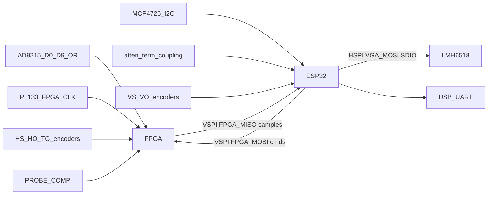

# Oscilloscope

FPGA + ESP32 firmware for an oscilloscope: the Tang Nano 20K buffers ADC samples; an ESP32 streams them to a laptop for display.

## Hardware

- Sipeed Tang Nano 20K (GW2AR-18C) — [datasheet](https://dl.sipeed.com/shareURL/TANG/Nano_20K/1_Datasheet)
- ESP32 NodeMCU-32S (laptop link)

## System architecture

Mermaid flowchart of ADC capture flow from the schematics. 



| Block | Role |
|-------|------|
| **ESP32** | VGA, LNA DAC, relays, vertical knobs, SPI master, stream frozen captures over USB-UART |
| **FPGA** | 100 Msps capture (`ADC_D*` + `FPGA_CLK`), SPI slave dump |

## Pinout

### ESP32 (NodeMCU-32S)

| Net | GPIO | Pin | Why |
|-----|------|------|-----|
| `SDA` | 21 | P42 | Hardware I2C (`VSPIHD` unused) |
| `SCL` | 22 | P39 | Hardware I2C (`VSPIWP` unused) |
| `FPGA_SCLK` | 18 | P35 | `VSPICLK` → FPGA dump only |
| `FPGA_MOSI` | 23 | P36 | `VSPID` → FPGA commands |
| `FPGA_MISO` | 19 | P38 | `VSPIQ` ← FPGA sample dump |
| `FPGA_CS` | 5 | P34 | `VSPICS0`, idle-high |
| `FPGA_IRQ` | 16 | P25 | Capture-ready; poll SPI if this pin is dropped |
| `VGA_SCLK` | 14 | P17 | SPI Clk for control of the `LMH6518SQ` |
| `VGA_MOSI` | 13 | P20 | MOSI control for the `LMH6518SQ` |
| `VGA_CS` | 15 | P21 | Chip select for the `LMH6518SQ` |
| `100X_10X` | 32 | P12 |  |
| `10X_1X` | 33 | P13 |  |
| `DC_COUP` | 25 | P14 |  |
| `50_OHM_TERM` | 26 | P15 |  |
| `DIAL_VS_A` | 36 | P5 |  |
| `DIAL_VS_B` | 39 | P8 |  |
| `DIAL_VS_BTN` | 34 | P10 |  |
| `DIAL_VO_A` | 35 | P11 |  |
| `DIAL_VO_B` | 17 | P27 |  |
| `DIAL_VO_BTN` | 4 | P24 |  |
| `ESP_FLEX_3` | 27 | P16 |  |

### FPGA (Tang Nano 20K) — assigned in Altium (J7 + J8)

| Net | J6/J7/J8 | FPGA pin | Nano silk | Why |
|-----|----------|----------|-----------|-----|
| `FPGA_FLEX_3` | J7-1 | 52 | `IOR39A` / BL616_UART_RX | J4 trigger mezzanine. Also the Nano BL616 UART RX — not a free GPIO |
| `FPGA_FLEX_2` | J7-2 | 53 | `IOR38B` / EDID_CLK | Same |
| `FPGA_FLEX_1` | J7-3 | 71 | `IOT44A` / HSPI_DIN0 | Same |
| `HW_TRIGGER` | J7-4 | 72 | `IOT40B` / HSPI_DIN1 | Digital trigger in from J4 |
| 3V3 | J6-2, J7-5 | — | 3V3 | I/O rail |
| GND | J6-1, J7-6, J7-19 | — | GND | Common ground with the ADC board |
| `ADC_OR` | J7-7 | 79 | `IOT27B` / `GCLKC_0` / 2812_DIN | Overflow. Shares onboard WS2812 DIN — leave WS2812 unused |
| `ADC_D9` | J7-8 | 86 | `IOT4A` / HSPI_CSN | MSB of the parallel bus |
| `ADC_D8` | J7-9 | 49 | `IOR49A` / LCD_BL | Consecutive down J7 |
| `ADC_D7` | J7-10 | 55 | `IOR36B` / I2S_LRCK | Consecutive |
| `ADC_D6` | J7-11 | 48 | `IOR49B` / LCD_DE | Consecutive |
| `ADC_D5` | J7-12 | 51 | `IOR45A` / PA_EN | Consecutive |
| `ADC_D4` | J7-13 | 54 | `IOR38A` / I2S_DIN | Consecutive |
| `ADC_D3` | J7-14 | 56 | `IOR36A` / I2S_BCLK | Consecutive |
| `ADC_D2` | J7-15 | 41 | `IOB43A` / LCD_R4 | Consecutive |
| `ADC_D1` | J7-16 | 42 | `IOB42B` / LCD_R3 | Consecutive |
| `ADC_D0` | J7-17 | 80 | `IOT27A` / SDIO_D2 | LSB |
| `FPGA_CLK` | J7-18 | 76 | `IOT30B` / `GCLKC_1` | 100 MHz from PL133 via 30 Ω (`R51`); must hit a global clock |
| 5V | J7-20 | — | 5V | Through Schottky `D12`; do not back-power blindly |

Reserved: `GPIO1`/`GPIO3` (USB-UART to the laptop), `GPIO6–11` (flash SPI0/1), `GPIO0`/`GPIO2`/`GPIO12` (strapping).

### J6

| J6 | FPGA pin | Nano silk |
|----|----------|-----------|
| 1 | — | GND |
| 2 | — | 3V3 |
| 3 | 18 | `IOL49B` / LED3 |
| 4 | 19 | `IOL51A` / LED4 |
| 5 | 20 | `IOL51B` / LED5 |
| 6 | 17 | `IOL49A` / LED2 |
| 7 | 31 | `IOB29A` / LCD_B3 |
| 8 | 30 | `IOB14B` / LCD_B4 |
| 9 | 29 | `IOB14A` / LCD_B5 |
| 10 | 26 | `IOB6B` / LCD_VS |
| 11 | 25 | `IOB6A` / LCD_HS |
| 12 | 28 | `IOB8B` / LCD_B6 |
| 13 | 27 | `IOB8A` / LCD_B7 |
| 14 | 16 | `IOL47B` / LED1 |
| 15 | 15 | `IOL47A` / LED0 |
| 16 | 77 | `IOT30A` / LCD_CLK |
| 17 | 85 | `IOT4B` / SDIO_D1 |
| 18 | 75 | `IOT34A` / HSPI_DIR |
| 19 | 74 | `IOT34B` / HSPI_DIN3 |
| 20 | 73 | `IOT40A` / HSPI_DIN2 |

### Trigger expansion (J3 / J4 / J5)

These 8-pin headers are a **future hardware-trigger mezzanine**, not the ADC data path.

| Header | Role |
|--------|------|
| J3 | Analog/power: `VGA_AUX_*`, ±5 V analog |
| J4 | FPGA via J7-1…4: `FPGA_FLEX_3`, `FPGA_FLEX_2`, `FPGA_FLEX_1`, `HW_TRIGGER` |
| J5 | ESP32: `SDA`/`SCL`, `ESP_FLEX_3` only (`ESP_FLEX_1`/`ESP_FLEX_2` used for `DIAL_VO_*`) |

### Schematic vs this map

Assigned on the current Altium pass: J7 ADC / `FPGA_CLK` / trigger+flex, and `PROBE_COMP` on J8-2 (FPGA ball still open).

Still to add on the next Altium pass:

- FPGA SPI (`FPGA_SPI_SCLK` / `CS` / `MOSI` / `MISO`) — every old J7 SPI ball is now ADC or trigger
- Encoders (`DIAL_HS_*`, `DIAL_HO_*`, `DIAL_TG_*`)
- `PROBE_COMP` FPGA ball (J8-2 exists; do not reuse J7-17 / pin 80 — that is `ADC_D0`)
- `FPGA_IRQ` on the ESP32 side
- VGA `VGA_SCLK` / `VGA_MOSI` / `VGA_CS` — do not tie them to the FPGA VSPI nets

Dump SPI is freeze-mode (~15–30 Mbps), not live 100 Msps.

Other constraints:

- Expect **capture → freeze → SPI dump → display**, not continuous roll at full sample rate (roll/decimation can run in the FPGA at a reduced rate).
- Deep memory and high UI refresh want a USB FIFO later; ESP32 is fine for bring-up, control plane, and modest capture depths.


## Repository layout

| Path | Role |
|------|------|
| `fpga/` | Tang Nano 20K RTL, constraints, Gowin build |
| `esp32/` | ESP-IDF firmware (streamer) |

## Build

**FPGA** (needs [Gowin EDA](https://www.gowinsemi.com/) `gw_sh` and [openFPGALoader](https://github.com/trabucayre/openFPGALoader)):

```bash
make -C fpga/ build
make -C fpga/ prog
```

**ESP32** (needs [ESP-IDF](https://docs.espressif.com/projects/esp-idf/)):

```bash
cd esp32
idf.py set-target esp32
idf.py build
idf.py flash monitor
```

## Branch protection (`main`)

Direct pushes and force pushes to `main` are not allowed. Work on a branch and open a pull request:

```bash
git checkout -b my-change
git push -u origin HEAD
# open a PR into main, then merge on GitHub
```

Enforcement is a GitHub **repository ruleset** (not Actions alone). The policy lives in [`.github/rulesets/main.json`](.github/rulesets/main.json).

### One-time ruleset setup

1. Create a fine-grained PAT with **Administration: Read and write** for this repository.
2. Add it as a repository secret named `RULESET_TOKEN`.
3. Run the **Apply main ruleset** workflow (`workflow_dispatch`), or apply locally:

```bash
export RULESET_TOKEN=...   # same PAT
export GITHUB_REPOSITORY=AveryLor/oscilloscope-dev
./.github/scripts/apply-main-ruleset.sh
```

Repository admins can bypass the ruleset for break-glass only. [`.github/workflows/guard-main.yml`](.github/workflows/guard-main.yml) also fails the Actions run if a forced push to `main` is ever observed.
